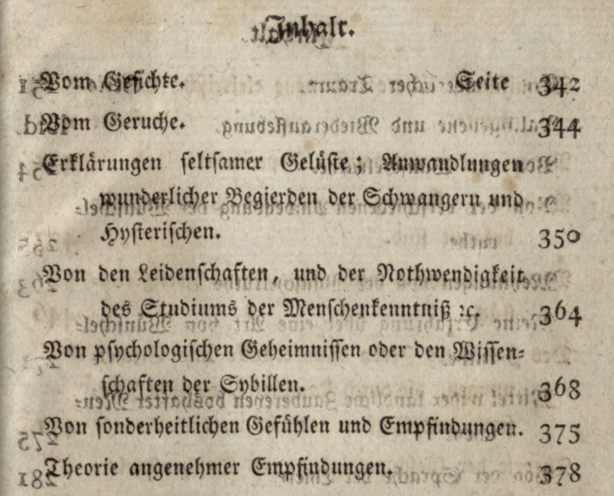
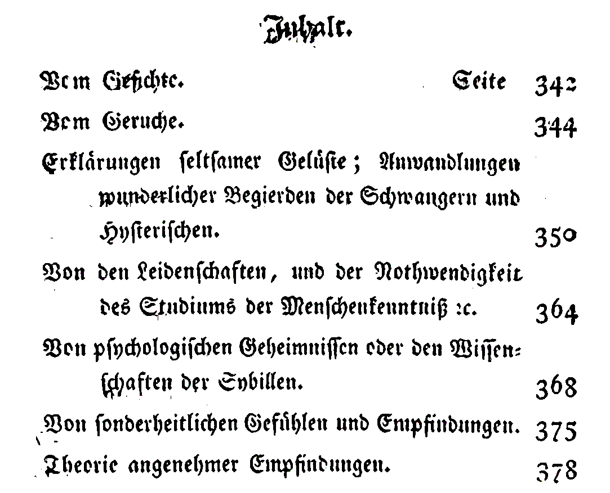
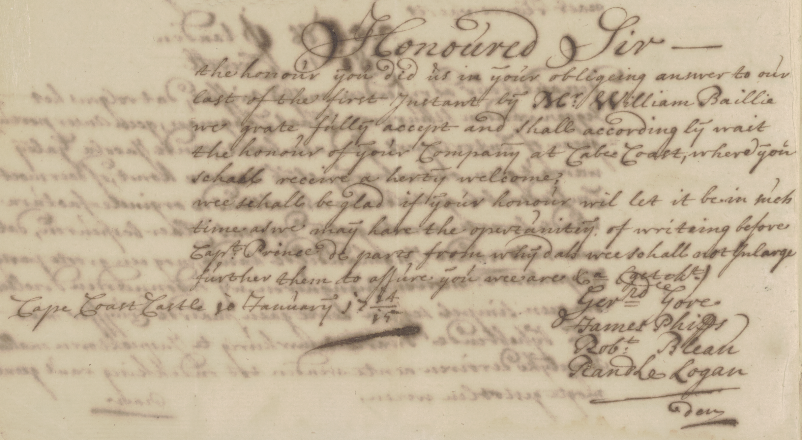
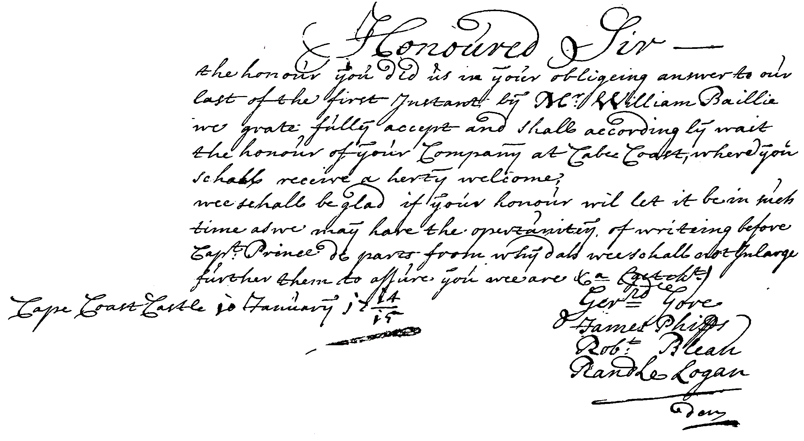

# DocEnTR
 
## Description
Pytorch implementation of the paper DocEnTr: An End-to-End Document Image Enhancement Transformer .... 
 
<table style="padding:10px">
    <tr>
        <td style="text-align:center">
            Degraded Images 
        </td>
        <td style="text-align:center">
            Our Binarization 
        </td>
    </tr>
    <tr>
        <td style="text-align:center"> 
            
        </td>
        <td style="text-align:center">
            
        </td>
    </tr>
    <tr>
        <td style="text-align:center"> 
            
        </td>
        <td style="text-align:center">
            
        </td>
    </tr>

</table>

## Download Code
clone the repository:
```bash
git clone https://github.com/dali92002/DocEnTR
cd DocEnTr
```
## Requirements
- install requirements.txt
- install vit-pytorch
```bash
pip install vit-pytorch
```
## Process Data
### Data Path
We gathered the DIBCO, H-DIBCO and PALM datasets and organized them in one folder. You can download it from this [link](https://drive.google.com/file/d/16pIO4c-mA2kHc1I3uqMs7VwD4Jb4F1Vc/view?usp=sharing). After downloading, extract the folder named DIBCOSETS and place it in your desired path.
 
### Data Splitting
Specify the data path, split size, validation and testing sets to prepare your data. In this example, we set the split size as (256 X 256), the validation set as 2016 and the testing as 2018 while running the process_dibco.py file.
 
```bash
python process_dibco.py --data_path YOUR_PATH --split_size 256 --testing_dataset 2018 --validation_dataset 2016
```
 
## Using DocEnTr
### Training
For training, specify the desired settings (batch_size, patch_size, model_size, split_size and training epochs) when running the file train.py. For example, for a base model with a patch_size of (16 X 16) and a batch_size of 32 we use the following command:
 
```bash
python train.py --data_path YOUR_PATH --batch_size 32 --vit_model_size base --vit_patch_size 16 --epochs 151 --split_size 256 --validation_dataset 2016
```
You will get visualization results from the validation dataset on each epoch in a folder named vis+"YOUR_EXPERIMENT_SETTINGS" (it will be created). In the previous case it will be named visbase_256_16.
 
### Testing on a DIBCO dataset
To be added ...
### Using our Pretrained Models To Binarize Degraded Images
To be added ...

## Trained Models
To be added ...

## Citation

If you find this useful for your research, please cite it as follows:

To be added ...